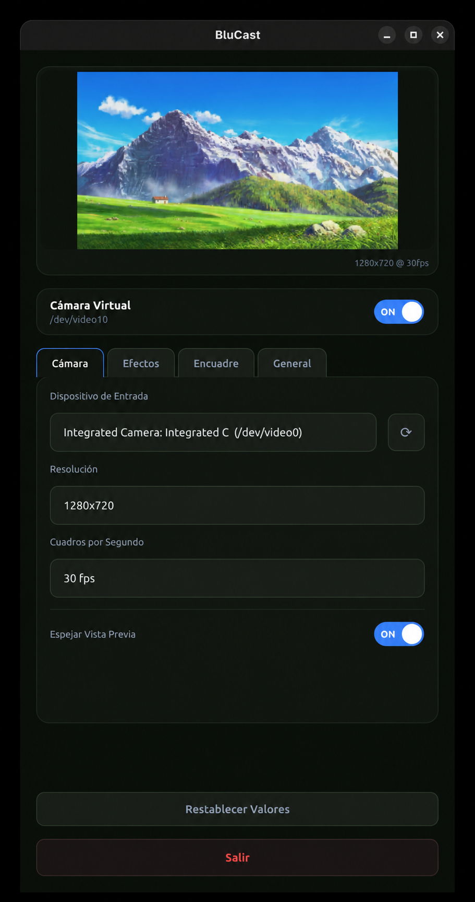

<div align="center">

 <h1 align="center">BluCast</h1>

<p align="center">
  Real-time AI-powered video effects using NVIDIA Maxine VideoFX SDK.<br>
  Basically NVIDIA Broadcast, but for Linux.
</p>

[](LICENSE)
[](https://github.com/MAlexVR/Blucast/releases)
[](https://github.com/MAlexVR/Blucast/commits/main)
[](https://github.com/MAlexVR/Blucast/issues)
[](#prerequisites)
[](#prerequisites)

</div>

<p align="center">
  
</p>

> [!NOTE]
> This is a fork of [Andrei9383/Blucast](https://github.com/Andrei9383/Blucast). See
> [Relationship to upstream](#relationship-to-upstream) for what's different and why.

<!-- omit from toc -->
## Table of Contents
- [Relationship to upstream](#relationship-to-upstream)
- [Features](#features)
- [Prerequisites](#prerequisites)
- [Quick Start](#quick-start)
- [Usage](#usage)
- [Configuration](#configuration)
- [Building from Source](#building-from-source)
- [Distribution / Packaging](#distribution--packaging)
- [Virtual Camera Setup](#virtual-camera-setup)
- [Uninstalling](#uninstalling)
- [Troubleshooting](#troubleshooting)
- [Versioning](#versioning)
- [License](#license)
  - [Third-Party Components](#third-party-components)
- [Contributing](#contributing)
- [Acknowledgments](#acknowledgments)

## Relationship to upstream

BluCast was originally created by [Andrei9383](https://github.com/Andrei9383/Blucast).
This fork builds on that work under the same MIT license — see
[License](#license) for the full picture, including how the NVIDIA SDK
dependency is handled. Everything upstream does still works here; this fork
adds:

- Auto Reframe (AI face tracking), Virtual Light, Mirror Preview, and manual
  zoom/pan controls
- A tabbed control panel and an English/Spanish UI language switch
- A build that no longer requires manually downloading the NVIDIA Maxine SDK

Full details, including what was tried and reverted, are in
[CHANGELOG.md](CHANGELOG.md).

## Features

- **Background Removal**
- **Background Replacement** - Use any image as your background
- **Background Blur**
- **Auto Reframe** - AI face tracking automatically zooms and pans to keep
  you centered as you move (DNN or Haar Cascade detector, adjustable zoom
  and tracking speed)
- **Virtual Light** - a soft, face-anchored brightening effect, approximating
  NVIDIA Broadcast's Virtual Key Light
- **Mirror Preview** - flips only your local preview, never the transmitted
  video
- **Manual zoom & pan** - with a compact on-screen D-pad
- **Multi-language UI** - English and Spanish
- **On-demand camera usage** - Camera (and processing power) is only used when needed
- **Native Wayland and X11 support** - Auto-detects your display server for seamless integration
- **Start at Login** - optional autostart, straight to the tray

## Prerequisites

The following must be installed on your host system **before** installing BluCast:

- **NVIDIA GPU**
- **NVIDIA drivers** with CUDA support - verify with `nvidia-smi`
- **Podman or Docker**
- **[NVIDIA Container Toolkit](https://docs.nvidia.com/datacenter/cloud-native/container-toolkit/install-guide.html)** - required for GPU passthrough into the container
  - Fedora: `sudo dnf install nvidia-container-toolkit`
  - Ubuntu: follow the [official install guide](https://docs.nvidia.com/datacenter/cloud-native/container-toolkit/install-guide.html)
- **[v4l2loopback](https://github.com/umlaeute/v4l2loopback)** - kernel module for the virtual camera device
  - Fedora: `sudo dnf install v4l2loopback`
  - Ubuntu: `sudo apt install v4l2loopback-dkms`
- **(if you're using GNOME):** [AppIndicator extension](https://extensions.gnome.org/extension/615/appindicator-support/) - required for the system tray icon
  - Without this extension, the system tray icon will not appear and closing the window will not minimize to tray

## Quick Start

The easiest way to get BluCast running:

```bash
curl -fsSL https://raw.githubusercontent.com/MAlexVR/Blucast/main/scripts/install-remote.sh | bash
```

> [!NOTE]
> **Fedora users:** After installation you will most likely need to generate the CDI spec for GPU passthrough to work. See [Error setting up CDI](#troubleshooting) in the Troubleshooting section.

> [!TIP]
> **Firefox users:** If the BluCast virtual camera doesn't appear in Firefox, open `about:config` and set `media.webrtc.camera.allow-pipewire` to `false`.

Or manually:

```bash
# Pull the container (published by upstream; see License below)
podman pull ghcr.io/andrei9383/blucast:latest

# Setup virtual camera (requires v4l2loopback)
sudo modprobe v4l2loopback devices=1 video_nr=10 card_label="BluCast Camera" exclusive_caps=1

# Run (X11)
podman run --rm \
  --device nvidia.com/gpu=all \
  --device /dev/video0 \
  --device /dev/video10 \
  -e DISPLAY=$DISPLAY \
  -v /tmp/.X11-unix:/tmp/.X11-unix \
  -v $HOME/.config/blucast:/root/.config/blucast \
  --network host \
  ghcr.io/andrei9383/blucast:latest

# Run (Wayland)
podman run --rm \
  --device nvidia.com/gpu=all \
  --device /dev/video0 \
  --device /dev/video10 \
  -e DISPLAY=$DISPLAY \
  -e WAYLAND_DISPLAY=$WAYLAND_DISPLAY \
  -e XDG_RUNTIME_DIR=/tmp/runtime-root \
  -e QT_QPA_PLATFORM=wayland \
  -v $XDG_RUNTIME_DIR/$WAYLAND_DISPLAY:/tmp/runtime-root/$WAYLAND_DISPLAY \
  -v /tmp/.X11-unix:/tmp/.X11-unix \
  -v $HOME/.config/blucast:/root/.config/blucast \
  --network host \
  ghcr.io/andrei9383/blucast:latest
```

After installation, run `blucast` from terminal or find it in your application menu.

## Usage

1. Launch BluCast by running the desktop entry application or by running `./run.sh` at the install location
2. Pick a background effect, adjust framing/lighting, and set your preferred language from the **Camera / Effects / Framing / General** tabs
3. For custom backgrounds, click "Browse" and select an image
4. The virtual camera appears as `/dev/video10`
5. Select "BluCast Camera" in your video conferencing app

## Configuration

Settings are stored in `~/.config/blucast/settings.json` and persist between sessions. This file is
managed by the app — you normally don't need to edit it by hand.

```json
{
  "effect_mode":            "blur",   // "blur" | "replace" | "remove" | "none"
  "background_image":       "",       // path to image, used when effect_mode is "replace"
  "blur_strength":          50,       // 0-100
  "resolution":             "1280x720",
  "fps":                    30,
  "input_device":           "",       // device path, eg "/dev/video0"
  "mirror_preview":         false,
  "zoom_factor":            100,      // 100-200, manual zoom (%)
  "pan_x":                  0.0,      // -1.0 to 1.0
  "pan_y":                  0.0,      // -1.0 to 1.0
  "auto_reframe":           false,
  "autoreframe_model":      "dnn",    // "dnn" | "haar"
  "autoreframe_zoom":       115,      // 100-200 (%)
  "autoreframe_speed":      35,       // 0-100
  "virtual_light":          false,
  "virtual_light_intensity": 50,      // 0-100
  "language":               "en"      // "en" | "es"
}
```

## Building from Source

If you prefer to build locally, you do **not** need an NVIDIA AI Enterprise
subscription for this: the compiled Maxine VideoFX runtime libraries and AI
models come from the already-published `ghcr.io/andrei9383/blucast:latest`
image (see [License](#license) for why that's allowed), and only the
MIT-licensed Maxine C++ headers are vendored directly in this repo
(`app/third_party/`).

### 1. Clone the repository

```bash
git clone https://github.com/MAlexVR/Blucast.git
cd Blucast
```

### 2. Build and run

```bash
./install.sh
```

That's it — `install.sh` builds the image (pulling the CUDA/cuDNN base
images and the `runtime-libs` stage automatically, no `sdk/` directory to
populate by hand), sets up the virtual camera, and installs a launcher and
desktop entry, same as the [Quick Start](#quick-start) installer.

<details>
<summary>Building the runtime libraries themselves from the raw NVIDIA SDK (advanced, optional)</summary>

You only need this if you want to rebuild `ghcr.io/andrei9383/blucast`'s
runtime-libs layer yourself — most contributors never need to.

> [!NOTE]
> The Maxine SDK (for version v0.7.2.0), as per upstream's testing, requires
> (very) specific versions of cuDNN and TensorRT:
> - CUDA 11.8.0
> - cuDNN 8.6.0.163
> - TensorRT 8.5.1.7

1. Visit the [NVIDIA Catalog](https://catalog.ngc.nvidia.com/), download the
   **Video Effects SDK** for Linux, plus **TensorRT 8.5.x** and **cuDNN 8.x**
   (check the exact versions the SDK docs require).
2. Extract everything into an `sdk/` directory:
   ```bash
   mkdir -p sdk
   tar -xzf Video_Effects_SDK_*.tar.gz -C sdk/
   mv sdk/Video_Effects_SDK* sdk/VideoFX
   tar -xzf TensorRT-8.5.*.tar.gz -C sdk/
   mkdir -p sdk/cudnn
   tar -xzf cudnn-*.tar.xz
   cp -r cudnn-*/lib/* sdk/cudnn/
   cp -r cudnn-*/include/* sdk/cudnn/
   ```
   Resulting layout:
   ```
   sdk/
   ├── VideoFX/
   ├── TensorRT-8.5.1.7/
   └── cudnn/
   ```
3. Build the runtime-libs image from that `sdk/` directory and point your
   own `Containerfile`'s `FROM` line at it instead of the published image.

</details>

## Distribution / Packaging

Today, installing BluCast means cloning this repo and running `install.sh`.
Two more familiar packaging formats were evaluated to make that easier:

**RPM — feasible, and the plan going forward.** BluCast's actual runtime is a
~7 GB container image (`ghcr.io/andrei9383/blucast`), so an RPM here wouldn't
bundle that image — it would follow the same pattern as
[`toolbox`](https://github.com/containers/toolbox) and
[`distrobox`](https://github.com/89luca89/distrobox) (both preinstalled on
Fedora Silverblue/Kinoite): the package ships only the host-side integration
— `run.sh` as `/usr/bin/blucast`, `control_panel.py`, the `.desktop` file and
icon, plus `Requires:` on `v4l2loopback-kmod` (already packaged in
[RPM Fusion](https://rpmfusion.org/)), `nvidia-container-toolkit`, and
`podman` — and the container image is pulled by podman on first run, exactly
like it is today. No NVIDIA binaries ever get bundled into the RPM itself.
The realistic path is a [COPR](https://copr.fedorainfracloud.org/) repo first
(no review process, fast iteration), with Fedora/RPM Fusion submission once
the package is stable.

**Flatpak — not a good fit, and not planned.** Flatpak's sandbox model
fundamentally conflicts with what this app needs to do: load a kernel module
(`v4l2loopback`) and launch *another*, fully-privileged container runtime
with raw NVIDIA GPU passthrough. The only way to make that work from inside
a Flatpak sandbox is `flatpak-spawn --host` with the
`--talk-name=org.freedesktop.Flatpak` permission — which grants arbitrary
host code execution and defeats the sandbox entirely. That's not "sandboxed
but inconvenient," it's a fake Flatpak wrapping a fully-privileged host
process, which is why no comparable app (nested container + kernel module +
NVIDIA CDI passthrough) ships one for real.

## Virtual Camera Setup

BluCast uses v4l2loopback to create a virtual camera. The installer handles this automatically, but if needed:

```bash
sudo modprobe v4l2loopback devices=1 video_nr=10 card_label="BluCast Camera" exclusive_caps=1
```

To load automatically on boot, create `/etc/modules-load.d/v4l2loopback.conf`:
```
v4l2loopback
```

And `/etc/modprobe.d/v4l2loopback.conf`:
```
options v4l2loopback devices=1 video_nr=10 card_label="BluCast Camera" exclusive_caps=1
```

## Uninstalling

```bash
./scripts/uninstall.sh
```

This stops any running containers, unloads the kernel module, removes all system config files (modprobe, udev, sudoers), and deletes the desktop entry and user settings.

## Troubleshooting

### No camera detected
- Ensure your webcam is connected: `ls /dev/video*`
- Check camera permissions: `groups | grep video`

### GPU errors
- Verify NVIDIA drivers: `nvidia-smi`
- Check Container Toolkit: `podman run --rm --device nvidia.com/gpu=all nvidia/cuda:11.8.0-base-ubuntu20.04 nvidia-smi`

### Error setting up CDI
- If you encounter an error such as: `Error: setting up CDI devices: unresolvable CDI devices nvidia.com/gpu=all`, that means the CDI spec hasn't been generated (yet). Try running:
`sudo nvidia-ctk cdi generate --output=/etc/cdi/nvidia.yaml`

## Versioning

This project follows [Semantic Versioning](https://semver.org/) (`MAJOR.MINOR.PATCH`):

- **MAJOR** — incompatible changes (e.g. a `settings.json` field is removed
  or repurposed, a container `FROM` base changes in a way that breaks old
  installs)
- **MINOR** — new features that don't break existing configuration or usage
- **PATCH** — bug fixes only

Every release is a Git tag (`vX.Y.Z`) on `main`; pushing a tag triggers
[`.github/workflows/publish.yml`](.github/workflows/publish.yml) to cut a
GitHub release, and [`remote-sign.yml`](.github/workflows/remote-sign.yml)
signs the corresponding container image with [cosign](https://github.com/sigstore/cosign)
once it's published. See [CHANGELOG.md](CHANGELOG.md) for the full history —
every notable change is recorded there before (or as part of) the release
that ships it, categorized as Added / Changed / Fixed / Removed following
[Keep a Changelog](https://keepachangelog.com/).

## License

This project is licensed under the **MIT License** — see [LICENSE](LICENSE)
for the full text. As a fork, it carries forward the original copyright from
[Andrei9383/Blucast](https://github.com/Andrei9383/Blucast) alongside this
fork's own changes, both under MIT.

### Third-Party Components

- **NVIDIA Maxine VideoFX SDK** — proprietary, © NVIDIA Corporation. This
  repository does **not** redistribute the SDK itself. The compiled runtime
  libraries and AI models are pulled at build/run time from
  `ghcr.io/andrei9383/blucast`, an image upstream publishes with NVIDIA's
  permission to redistribute SDK components in binary form (per the Maxine
  SDK license terms), which is why the NVIDIA Maxine name and this note are
  kept visible here as required attribution. If you build your own runtime
  libraries from the raw SDK, you are separately bound by the
  [NVIDIA Maxine SDK License Agreement](https://catalog.ngc.nvidia.com/).
- **Maxine C++ headers** (`app/third_party/`) — MIT License, © NVIDIA
  Corporation, vendored directly from
  [NVIDIA-Maxine/Maxine-VFX-SDK](https://github.com/NVIDIA-Maxine/Maxine-VFX-SDK)
  (verified against that repository's own `LICENSE` file).
- **OpenCV** — Apache License 2.0.
- **DNN face detector model** (`app/models/face_detector.prototxt` /
  `.caffemodel`) — the standard SSD/ResNet-10 face detector distributed
  alongside OpenCV's own official `samples/dnn/face_detector`, used
  unmodified (aside from a one-line compatibility fix for older OpenCV
  releases — see the file's own comments).
- **PySide6** — LGPL v3 (dynamically linked, unmodified).
- **TensorRT / cuDNN** — proprietary, © NVIDIA Corporation, used only as
  transitive dependencies of the Maxine SDK's own runtime libraries.

## Contributing

Contributions are welcome! Please read [CONTRIBUTING.md](CONTRIBUTING.md) for guidelines.

## Acknowledgments

- [Andrei9383](https://github.com/Andrei9383) for creating and maintaining the original BluCast
- NVIDIA Maxine team for the VideoFX SDK
- OpenCV community
- Qt/PySide6 project
